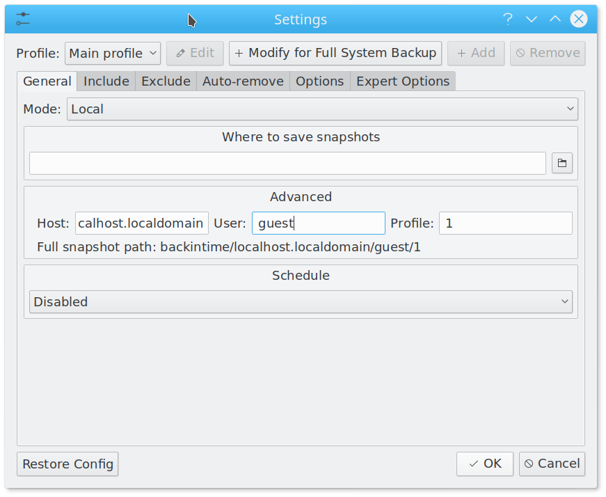
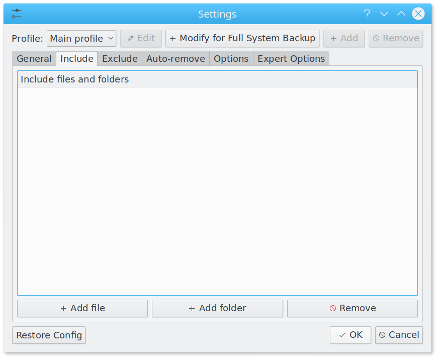
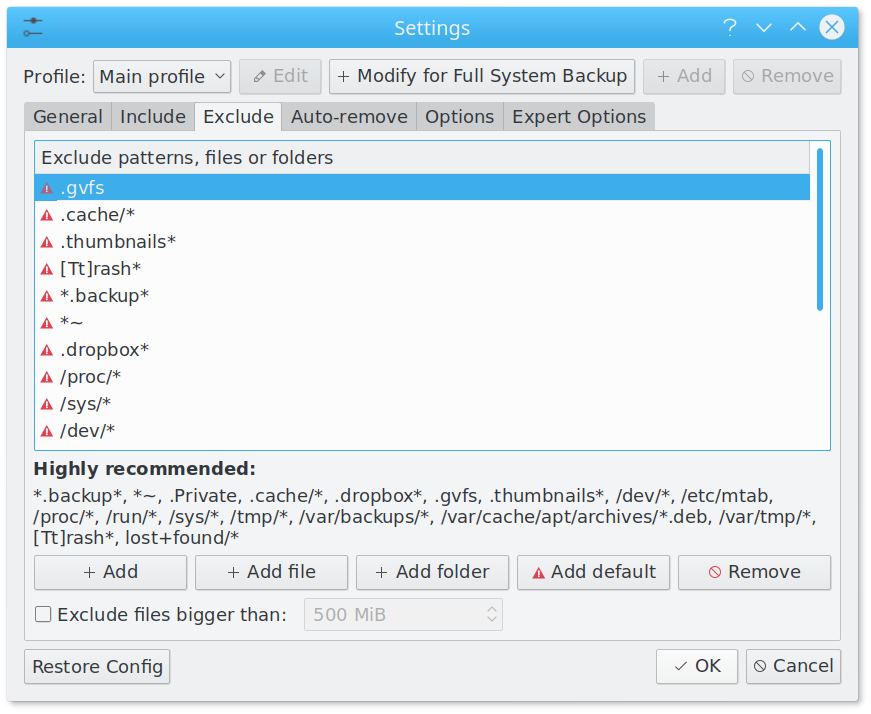
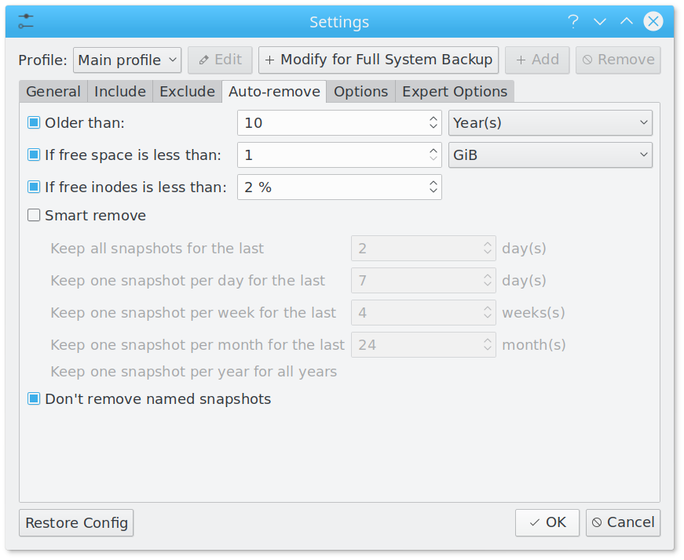
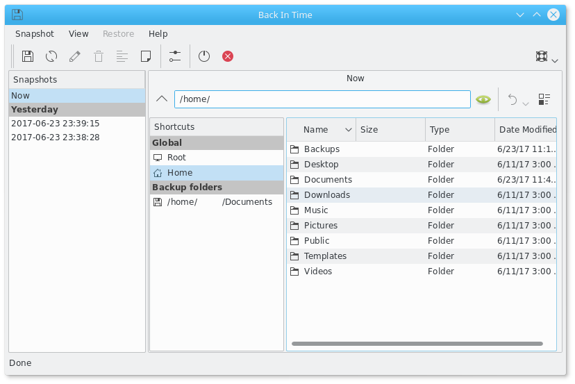
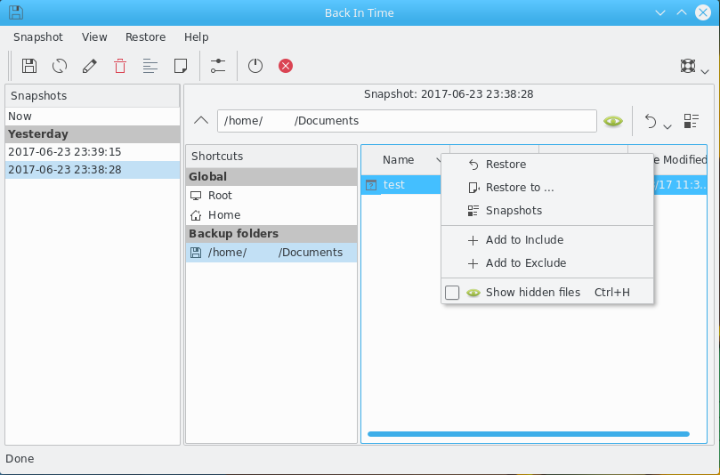

Backing Up Your Machine with Back In Time
=========================================

Back In Time is a backup application for Linux, targetted at GNOME and KDE desktops. It leverages the powerful `rsync` tool on the backend, a longtime favorite of Sys Admins and Linux enthusiasts. However, BiT contains a graphical frontend, making it more approachable for beginners. The ease of initial setup in no way diminishes its capabilities:  Back in Time is highly configurable and supports multiple backup profiles, allowing for scheduled backups to both local and remote sources. This gives BiT an advantage over Déjà Dup and may prove attractive for anyone wishing to implement the 3-2-1 rule with backups.

**NOTE**: This article is not an exhaustive guide to Back in Time. It will not cover all of the menu options or backup scenarios. For that, you are encouraged to visit Back in Time's [website](https://github.com/bit-team/backintime) or review its [documentation](http://backintime.readthedocs.io/en/latest/index.html). This guide is aimed at new users who wish to quickly setup a simple backup solution.

## Installing Back in Time

Back In Time is pre-installed on the KDE version of Korora. It is not installed on Gtk-based desktops to avoid pulling in too many Qt libraries. However, if you wish to install Back In Time manually, you may do so file the following command:

    dnf install backintime-qt4

Again, be aware that you may pull in a number of Qt libraries in the process.

## Using Back in Time

When Back in Time is first launched, you will be prompted to configure it for the first time.

If you ever need to get back to this menu, you can select it under the **Snapshot -> Settings** option.

Under the option "Mode", you will select one of four modes under which the back up will run. These options are:
- Local - Creates a local snapshot of the selected data. The files will be in plaintext.
- Local encrypted - Creates a local snapshot of the selected data, but encrypts the snapshot using EncFS for encryption. You will be prompted for an encryption password if you choose this option.
- SSH - Creates a snapshot of the selected data on a remote server over SSH/rsync. You will be prompted for the remote destination's IP, port, and the user used to connect.
- SSH encrypted - Creates an encrypted snapshot of the selected data on a remote server.

**NOTE**: It is **highly recommended** to encrypt your backups if you are backing up to a remote server that you do not own. The cloud storage provider might claim that they can't see anything on your instance, but why take them at their word? Do you really want even the *possibility* to exist that Amazon could peek at the contents of your AWS instance?

No matter which option you use, you will need to make sure that the storage device supports [hard-links](https://en.wikipedia.org/wiki/Hard_link). Back in Time uses hard-links to save space when the same file is identical across multiple backups and has not changed.

### Selecting Files to Include

Select the "Include" tab to be brought to the Selection menu where you can decide which files or folders you wish to include in your backup.

Click `Add File` if you wish to add an individual file to the backup list. Click `Add Folder` if you wish to add an entire folder/directory to the backup list.

### Selecting Files to Exclude

Select the "Exclude" tab to be brought to the selection menu where you can decide which files or folders you wish to exclude from your backup.

The Exclude menu is pre-populated with several Recommended entries. These include areas that are either unimportant and not worth backing up (e.g. /tmp, Trash, etc) or that would be potentially dangerous to restore (e.g. /dev).

**NOTE**: You can use the Include and Exclude menus together in order to avoid having to hand-pick too much stuff. For instance, if you wish to include `/foo` but want the subdirectory `bar` excluded, you can nonetheless add `/foo` to the Include, while adding `/foo/bar` to the Exclude, and Back In Time will skip `/foo/bar`, while picking up everything else inside `/foo`, including `/foo/baz`, etc. 

### Automatically Deleting Old Backups

Back in Time enables, by default, options to delete old backups after they have exceeded a certain size or age. To access this menu, click the `Auto-remove` tab.

The default settings will remove any backups that are over ten years old when less than 1 GB of memory or less than 2% of the storage capacity is free. This setting is more for use in emergency situations when your hard-drive runs desperately low on space. You can also activate the "Smart remove" options below, which can be scheduled to automatically prune old backups after a certain amount of time.

### Scheduling Automatic Backups

To schedule a backup to run automatically, return to the General tab where you originally started and locate the drop-down field under the Schedule label. It will be set by default to "Disabled". From here, you can select the frequency with which you wish Back in Time to automatically run. Your options include:

- At every boot/reboot
- Every hour
- Every day
- Every week
- Custom hours
- When drive get connected (udev)

You can already see how these options can easily create a robust backup routine. For instance, if you have an external hard-drive onto which you wish to back up, you could set a schedule to use the option "When drive get connected (udev)" and specify the drive. Then, whenever the external is plugged into your computer, the backup would immediately kick off and create a new snapshot. Time-based schedule options will run as a cron job in the system crontab.

## Multiple Backup Profiles

As already mentioned, Back in Time supports multiple profiles, allowing you to customize exactly what and when each backup occurs.

You will see the "Profile" section at the top left of the Menu screen. If you have only one profile setup, the drop-down selection will default to "Main profile". However, you can click the "Add" button on the right to initialize a new profile. The new profile will be as flexible as the Main profile, and can be used to address whatever shortcomings your regular profile might have. Below are some examples of how a main and an alternate profile can help you create an automated backup schedule that completely protects your data:
- A "Main" profile that runs every night and backs up only important personal data, and a "Full" profile that runs once a month and backs up the entire system.
- A "local" profile that backs up data to an external hard-drive when it is plugged into the machine, and an "off-site" profile that backs up the data to a cloud storage provider, i.e. Dropbox, Google Drive, Amazon Glacier, etc.
- A "sync" profile that backs up data every fifteen minutes (in case your computer suddenly crashes and data is lost), and a "backup" profile that backs up data every night (so that you have a safe "reversion" point in case a file's change or deletion is not discovered until the following day).

Experiment with the options above and find a combination that works for you. Remember, if you want to follow the [3-2-1 rule](http://blog.trendmicro.com/trendlabs-security-intelligence/world-backup-day-the-3-2-1-rule/), you should data should:
- Exist in at least three different places (original data + two backups)
- On two different storage mediums (you probably don't have a tape drive or a CD/DVD burner anymore, but at least try to make sure that all of your backup mediums aren't the same kind of hard-drive)
- At least one is off-site for disaster recovery (expect to spend a little money to accomplish this; either to pay someone else for the cloud storage or to build your own self-hosted solution)

## Viewing Your Backups/Snapshots

Once you have configured everything to your liking and you have successfully made a backup, you will be brought to the main menu to look at your Snapshots.

Each Snapshot will be given a timestamp name based on when the snapshot occurred. If you would like to give a particular snapshot a more specific name (e.g. "Before Fedora 26 Upgrade"), you can highlight the snapshot you would like to modify, then select the menu option **Snapshot -> Snapshot Name** to give it a specific name. Named Snapshots are considered special and will usually be skipped by the automatic removal utility.

When viewing a snapshot, you can examine the files contained within that backup. You can also right-click on a File or Folder and click the "Snapshots" button to see how the file looks within the various snapshots you've taken. The "Diff" tool will attempt to determine whether two iterations of the file contained within the various snapshots are different.

## Restoring from Backup

If you have found a file or files that you would like to restore from the backup snapshot, highlight the file within that snapshot and click "Restore". This will restore the file from the snapshot to its original location. If you would like to restore the file to a different location so that it won't overwrite what is currently in the original location, select "Restore to...".

## Summary

We have covered how to configure Back in Time for both simple and moderately complex backup solutions.

Key points to remember:
- Backups in Back in Time are called "Snapshots." Each snapshot can be freely explored, and individual files can easily be pulled out of any snapshot. Snapshots are named by timestamp by default, but can be given unique names if desired.
- Back in Time can be run on-demand or scheduled to run automatically. 
- Back in Time supports multiple profiles, meaning you can configure one backup profile to backup `/foo/bar` and `/foo/baz` every night, and another profile to backup the larger `/foo` once a month. 
- Back in Time is highly configurable, with options not discussed here. Review the [manual](http://backintime.readthedocs.io/en/latest/index.html) and the [FAQ](https://github.com/bit-team/backintime/wiki/FAQ) for more details.