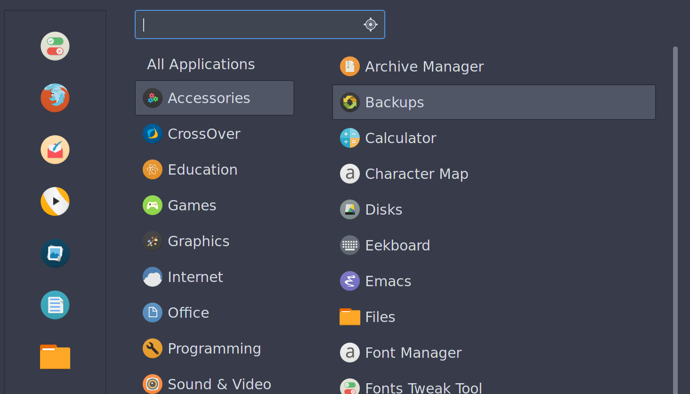
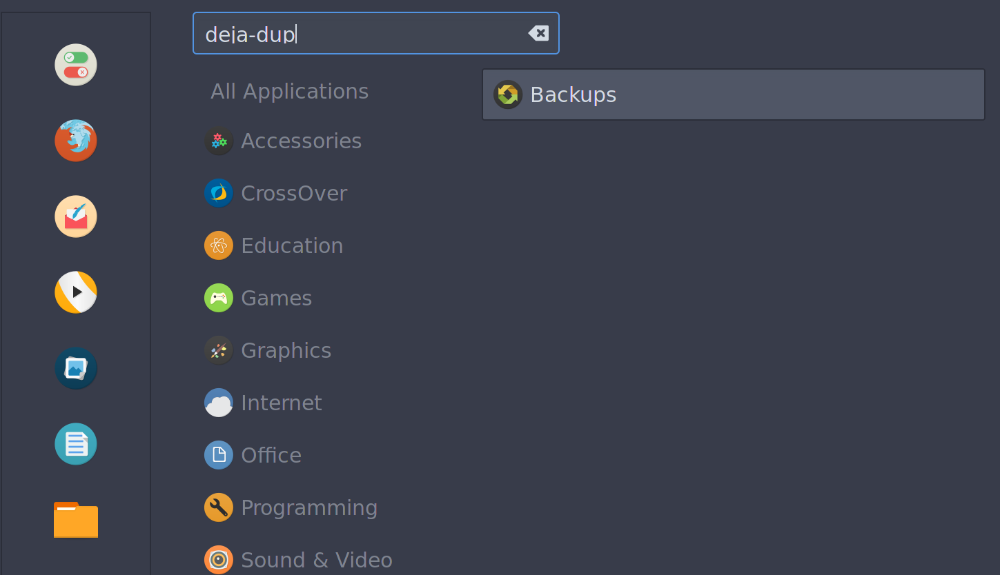
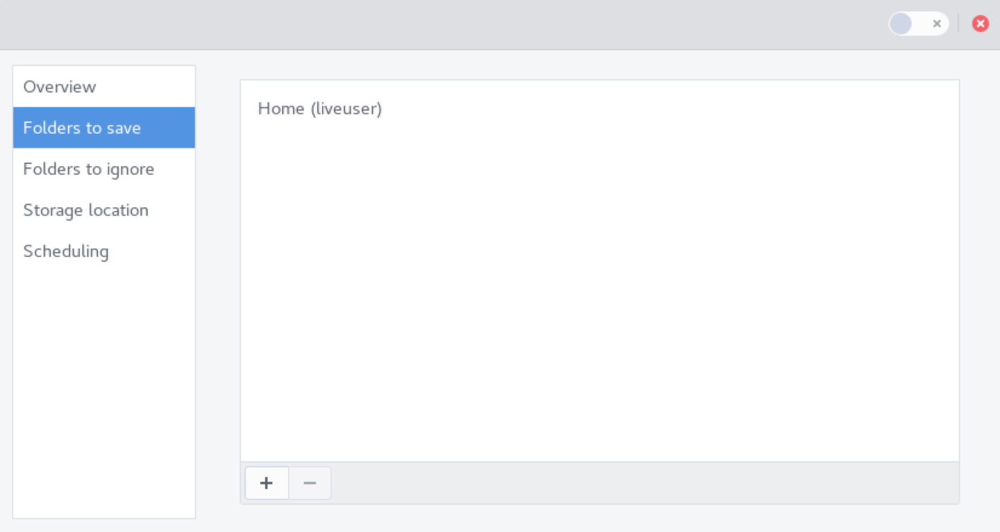
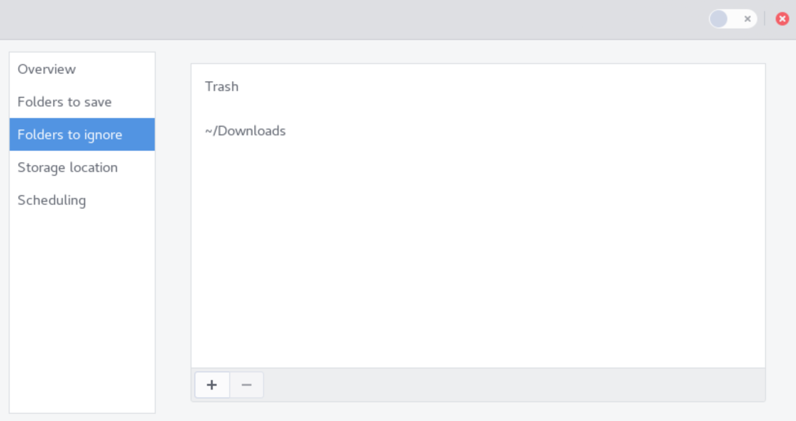
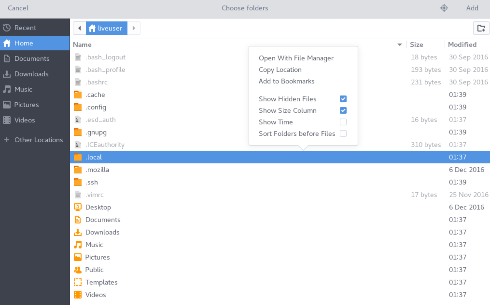
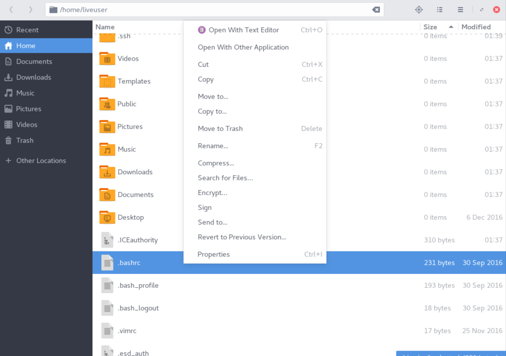
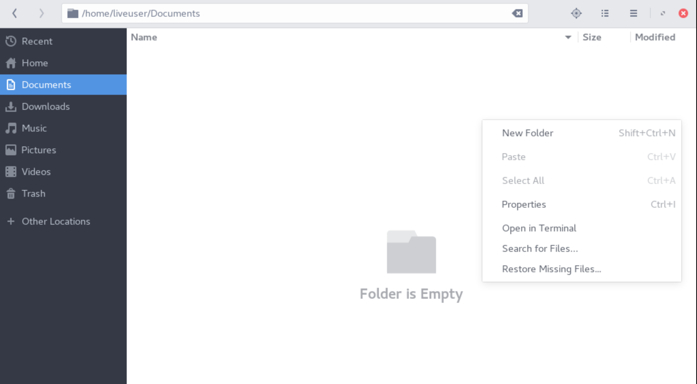

How To Backup Your System
=========================

Deja-dup is a simple backup program that should be bundled with most versions of Korora.

For Mate and XFCE, it can be installed manually via the following command:
    dnf install deja-dup

## Why You Should Make a Backup

A backup protects your files from data loss, malware infections, and inadvertent deletions. Storing your important files in a backup location allows you to restore those files to your computer should they ever be removed, go missing, or otherwise become corrupted.

## What to Backup

Ideally, you should be backing up all personal files and directories that are important to you. Only you can know for sure what directories are important to you, but it goes without saying that files such as pictures downloaded from your camera may hold more sentimental value than, say, your internet browser's cache.

If you wish to try to preserve your application data, you may need to research where each individual app of interest tends to store its data. If your application follows standard conventions, it likely stores its settings somewhere in the user's home directory. So it may not be a bad idea to backup:
- ~/.config
- ~/.local
- /opt (If you wish to backup the application itself)
- /usr/local/share
- /etc

Be aware that within application directories there may also reside cache subdirectories that can probably be excluded in order to reduce the size of the backup.

**NOTE**: "~/" is an alias to the user's home directory. So if you are logged in as 'guest', ~/.config would evaluate to */home/guest/.config* by the system.

### Installing Deja-Dup
Deja-Dup is preinstalled on the following Korora desktops:
- GNOME
- Cinnamon
- KDE

If you need to install it on XFCE or Mate, you can either grab the deja-dup package from Yumex/dnfdragora, or install it manually from a terminal by typing the following command:

    dnf install deja-dup    

When installed, the application will show up in the Menu under **Menu -> Accessories -> Backups**. 

You can still search for the app "deja-dup", and Backups will show in the results.

## Making a Backup

Launch Deja-Dup / Backups. If you have not launched it before, you will need to configure what directories to include by clicking the "Folders to save" tab. By default, the current user's Home directory will be included.

Click the tab "Folders to ignore" and add any subdirectories within your Saved folders that you want Deja-Dup to skip.

**NOTE**: Since many subdirectories that you may wish to add to the Save or Ignore pile are hidden, you may not be able to see them inside your File Manager program with the default settings. Should that happen, when you are presented with the prompt to Choose Folders pop-out menu, right-click the menu and check the box "Show Hidden Files". 

### Restoring Files via Deja-Dup

If your file manager does not support direct integration with Deja-Dup, you can use the deja-dup from the command-line to manually restore files.

#### Restoring an Individual File

To restore or revert an individual file using Deja-Dup, right-click on the file and select `Revert to Previous Version...`:

If that option is not available in your File Manager, enter the following command in the terminal:

    deja-dup --restore /path/to/file

#### Restoring a Directory

To restore a directory of all missing files via Deja-Dup, open the directory in question and right-click anywhere inside the folder. Then select the option `Restore Missing Files...`:

If that option is not available in your File Manager, enter the following command in the terminal:

    deja-dup --restore-missing /path/to/dir