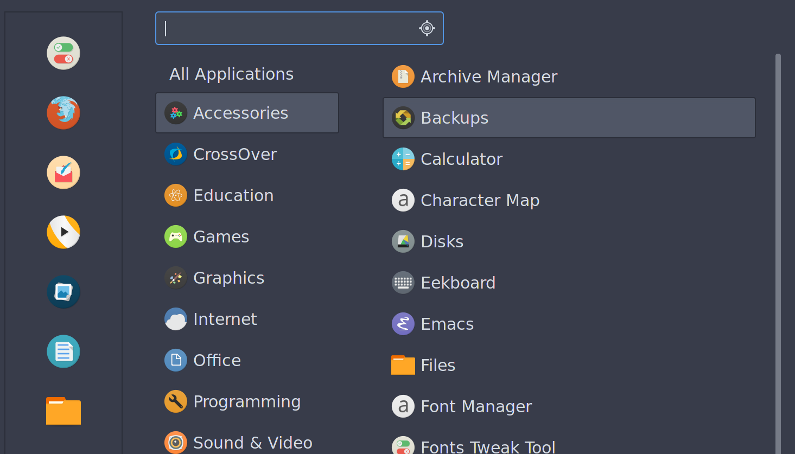
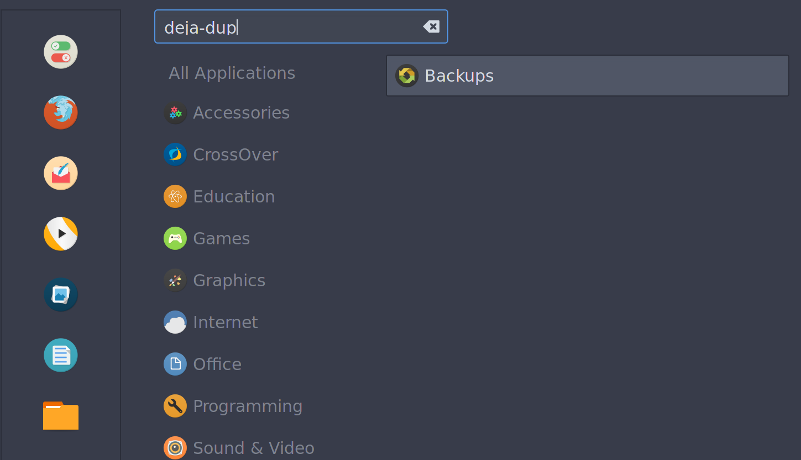
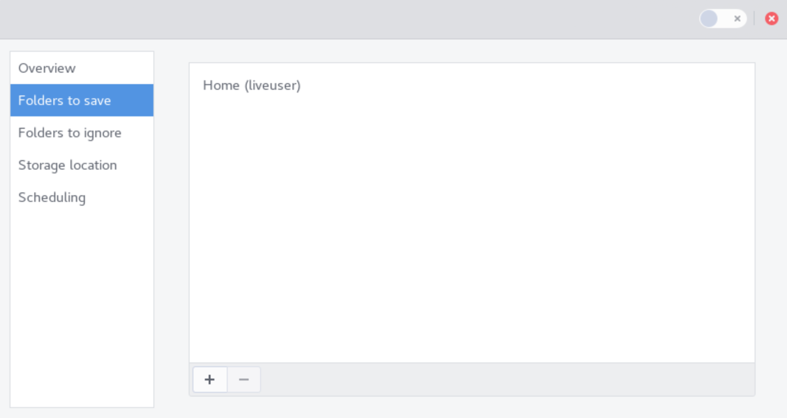
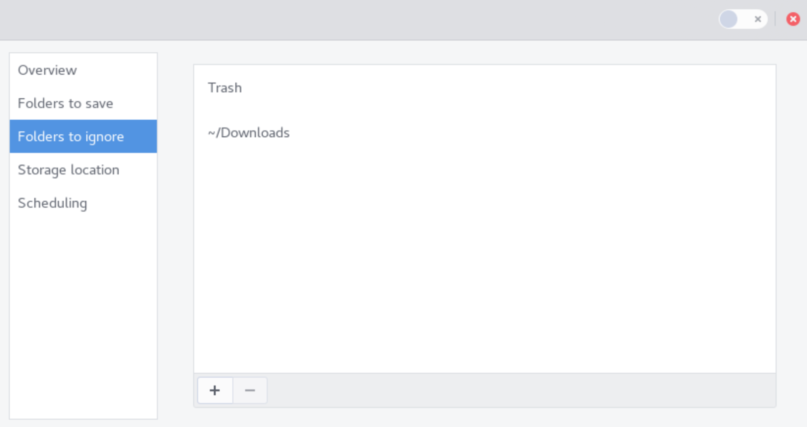
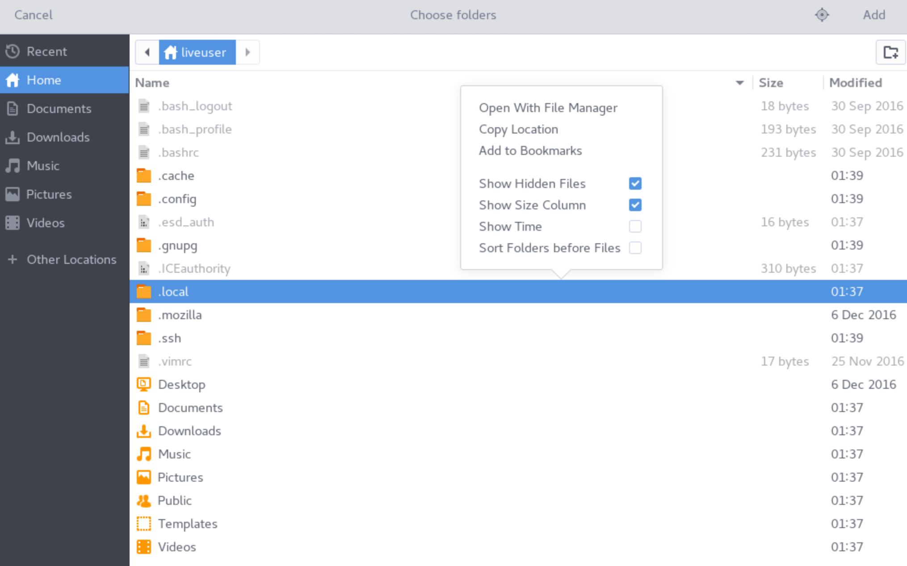
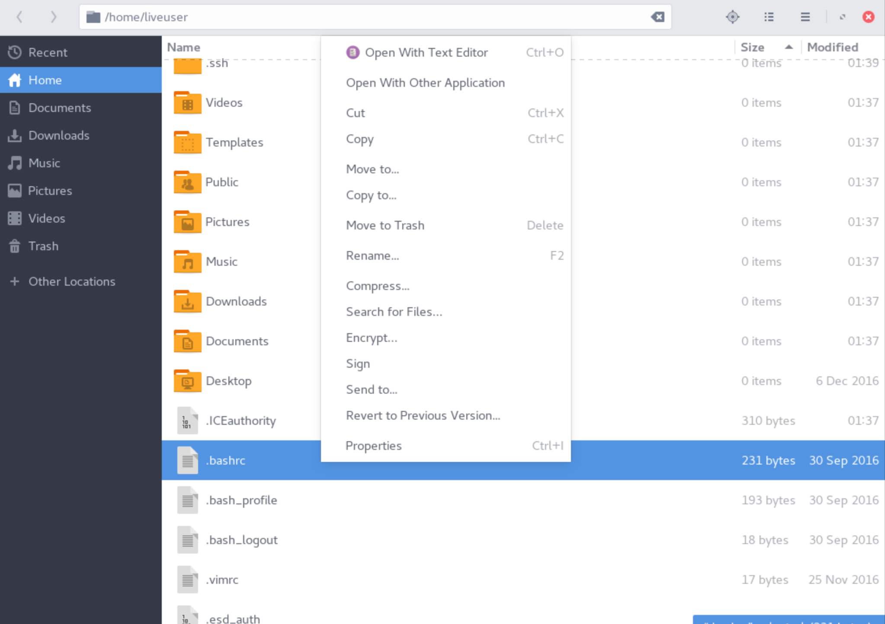
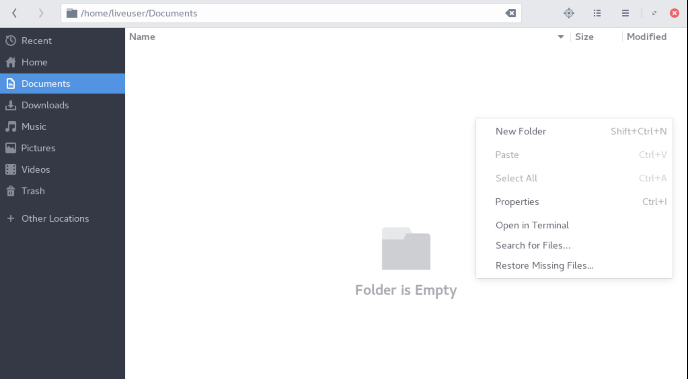

How to Backup with Deja-Dup
============================

Deja-dup is a simple backup program that should be bundled with most versions of Korora. It will allow you to save copies of your important files, applications, or system settings to a secondary location, where they can be restored if something should happen to your primary computer.

### Installing Deja-Dup
Deja-Dup is preinstalled on the following Korora desktops:
- GNOME
- Cinnamon

If you need to install it on KDE, XFCE, or Mate, you can either grab the deja-dup package from Yumex/dnfdragora, or install it manually from a terminal by typing the following command:

    dnf install deja-dup    

When installed, the application will show up in the Menu under **Menu -> Accessories -> Backups**. 

You can still search for the app "deja-dup", and Backups will show in the results.

## Making a Backup

Launch Deja-Dup / Backups. If you have not launched it before, you will need to configure what directories to include by clicking the "Folders to save" tab. By default, the current user's Home directory will be included.

Click the tab "Folders to ignore" and add any subdirectories within your Saved folders that you want Deja-Dup to skip.

**NOTE**: Since many subdirectories that you may wish to add to the Save or Ignore pile are hidden, you may not be able to see them inside your File Manager program with the default settings. Should that happen, when you are presented with the prompt to Choose Folders pop-out menu, right-click the menu and check the box "Show Hidden Files". 

### Restoring Files via Deja-Dup

If your file manager does not support direct integration with Deja-Dup, you can use the deja-dup from the command-line to manually restore files.

#### Restoring an Individual File

To restore or revert an individual file using Deja-Dup, right-click on the file and select `Revert to Previous Version...`:

If that option is not available in your File Manager, enter the following command in the terminal:

    deja-dup --restore /path/to/file

#### Restoring a Directory

To restore a directory of all missing files via Deja-Dup, open the directory in question and right-click anywhere inside the folder. Then select the option `Restore Missing Files...`:

If that option is not available in your File Manager, enter the following command in the terminal:

    deja-dup --restore-missing /path/to/dir